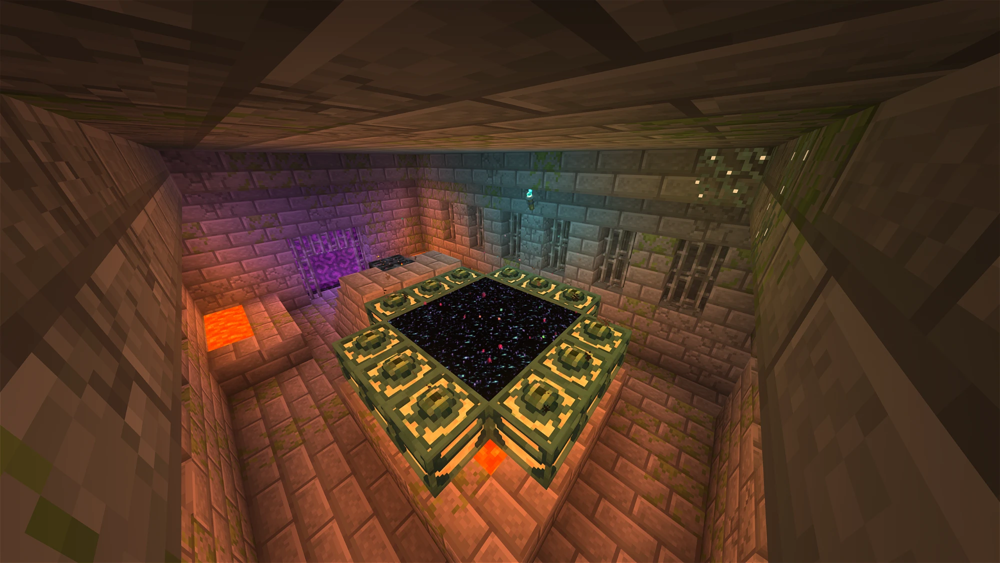
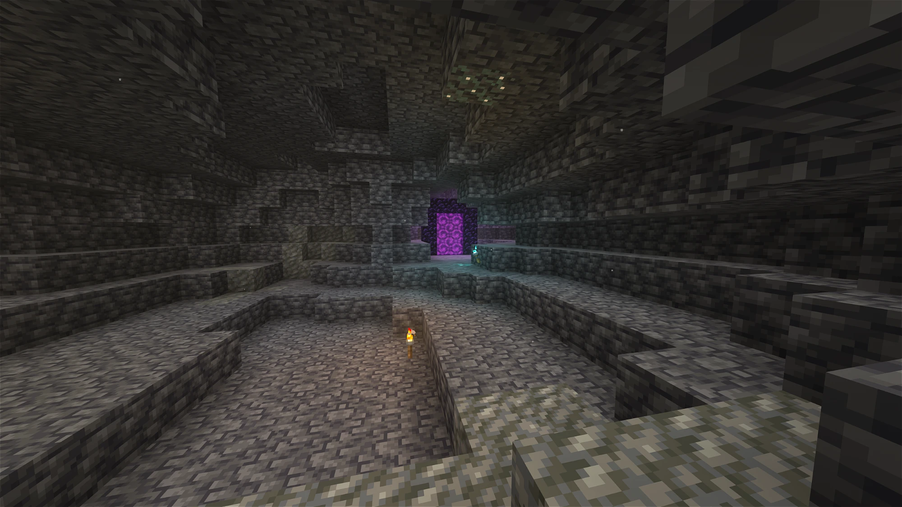
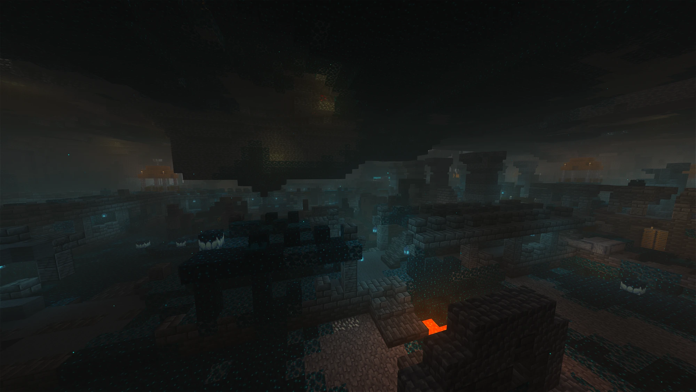
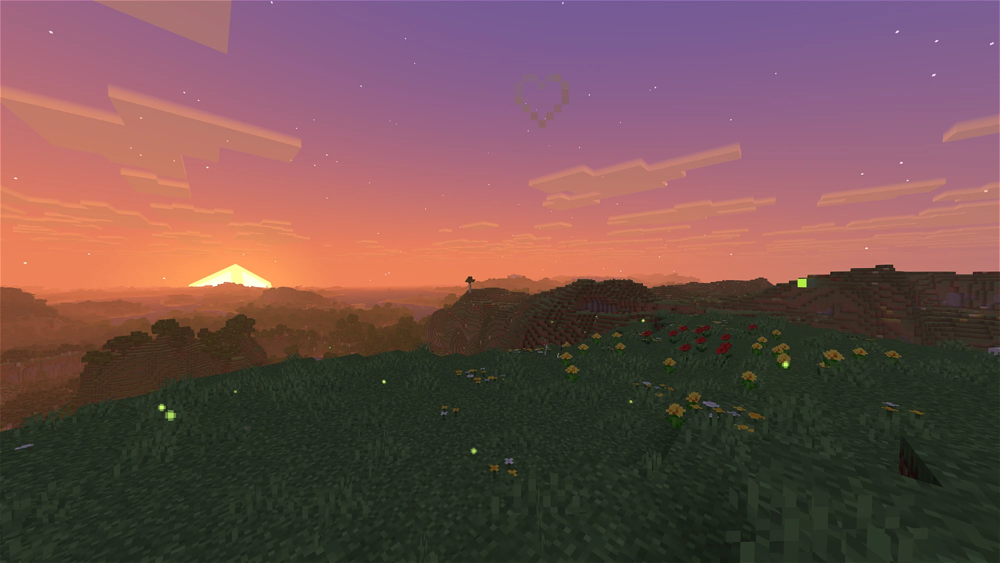

# ILV-CL — I Like Vanilla: Colored Lighting

**ILV-CL** is a fork of **[I Like Vanilla](https://github.com/What42Pizza/I-Like-Vanilla)** by **What42Pizza** (published with the author's permission) that adds a full **colored voxel-lighting system** on top of the original's vanilla-faithful look, along with Distant Horizons support and a long list of lighting, reflection, fog and material fixes.

It's based on **I Like Vanilla v1.4.0b**. Everything else (style, settings, look) is the original shader. All credit for it goes to What42Pizza and the people credited below.

> **About the code:** every change in this fork was written by **Claude** (Anthropic's AI). The maintainer of this fork ([Kukidoo](https://github.com/Kukidoo)) designed, tested and directed the changes in-game, but **did not personally write a single line of code**.

### [⬇ Download the latest release](https://github.com/Kukidoo/ilv-CL/releases/latest)

 

## Screenshots

 

## What ILV-CL adds

### Colored voxel lighting (new system, not in stock ILV)
- **Floodfill colored light:** light sources are voxelized and their color is flood-filled through a 3D volume around you. It works in **every dimension** and **doesn't depend on real-time shadows**. This is an independent reimplementation of the technique used by Complementary Reimagined.
- **Per-source colors:** 24 light sources each have their own **hue + saturation** sliders: torch, soul fire, redstone, lava, lava cauldron, glowstone, shroomlight, magma, sea lantern, beacon, conduit, the three froglights, amethyst, glow lichen, cave vines, crying obsidian, end rod, nether portal, sculk and sculk sensor. Master strength, saturation, reach and volume size are adjustable too.
- **No light leaks:** full blocks block colored light (including unregistered/modded full cubes), while partial blocks (slabs, fences, Create parts…) still pass it. Surfaces and particles never pick up light from the far side of a wall or around a block edge (filter adapted from Complementary's corner-leak fix).
- **Colored fog glow:** a light source's color bleeds softly into the surrounding fog.
- **Day / night balance:** the colors stay readable in daylight and get more vivid at night.
- **Handheld and dynamic light:** a light item in either hand lights the world in its own color (per hand). Dropped items, items held by mobs and glowing mobs (glow squid, magma cube) emit colored light too.
- **Dynamic lights keep their own colour:** with mods like LambDynLights, light from burning mobs or dropped torches stays warm instead of amplifying the colored light around it. Your own held items still add to it. This can be toggled.
- **Copycat blocks:** copycats from Create, Copycats+ and Create Connected that hold a light-source material (glowstone, froglights, sea lantern…) glow in that material's color.
- **Redstone:** powered wire glows and casts red light scaled by signal power. Repeater and comparator torches glow like real torches. Vanilla and Create redstone devices cast red light.
- **Sculk shrieker souls** glow fullbright, the way Complementary does it.
- **Particles** take colored light like the surfaces around them, fade smoothly when they move behind blocks, and are lit by the sun and sky without direction (no more dark particles at dusk or in the Nether).

### Enchantment Outlines resource pack support
- Enchanted items render **fullbright**, in your hand and on other players and mobs. They have their own brightness slider. Enchantment Glint Strength is left untouched.
- The first-person **outline** keeps its translucency and is tinted with the glint color, and translucent blocks and entities behind it render correctly.
- An enchanted item in your hand casts a small **purple light** (adjustable or off), which mixes correctly with a light source in your other hand.

### Water, reflections and fog
- Distant Horizons water reflects and is covered by atmospheric fog.
- Breaking overlays, particles, held items, nametags and mod UI no longer leak into reflections (this fixes the chest-breaking "mirror").
- Cleaner glass, ice and underwater reflections.
- The Darkness effect fades to dark instead of flashing white.

### Lighting and material fixes
- labPBR metal fix (F0 230–255 values are metal indices, not reflectance).
- Burning mobs' flames render at vanilla brightness.
- Breaking chests and other block entities shows dark cracks (not white).
- No bright "shadow blob" under mobs with shadows off. Nametags render flat. The player's outer skin layer is no longer see-through.
- Create contraptions no longer turn grass-green. Wildflowers and plant stems have correct brightness.

### Settings
- **Colored Lighting** menu right in the main settings screen.
- Two complete profiles:
  - **ColoredLight:** the recommended configuration.
  - **ColoredLight-lite:** the same look tuned for weaker GPUs (e.g. laptop RTX 3050 4 GB). It uses a smaller color volume, fewer fog and reflection steps and a lighter Nether voxelization pass.
- Debug views for the colored-lighting system.

See [changelog.md](changelog.md) for the full ILV-CL history.

 

## Requirements

- Minecraft with **Iris** or **Oculus**. ILV-CL was developed and tested on NeoForge 1.21.1 with Oculus/Iris 1.8.
- Optional: Distant Horizons, LambDynLights, the Enchantment Outlines resource pack, Create and copycat mods.

 

## Original I Like Vanilla features

- **Settings-based Styles System**
- **Extremely sharp AA**
- **Colorblindness Correction**
- **Isometric Rendering**
- **Volumetric Clouds** (optional, disabled in default config)
- **Voxy and Distant Horizons Support**
- **Colorwheel support**
- **Shadows**
- **Reflections**
- **Sunrays** (both screen-space and volumetric)
- **Depth of Field**
- **World-Pixelated Shadows**
- **SSAO**
- **Bloom**
- **Motion Blur**
- **Misc Post-Processing**
- - Health Effects
- - Underwater Waviness
- - Vignette
- - Tonemapping and Color Correction
- **Vanilla-Like Graphics and Style**
- **Thorough Settings Menu**

The original shader: [GitHub](https://github.com/What42Pizza/I-Like-Vanilla) · [Modrinth](https://modrinth.com/shader/i-like-vanilla) · [CurseForge](https://www.curseforge.com/minecraft/shaders/i-like-vanilla) · [Discord](https://discord.com/invite/h99ZBex9nZ)

**Please report ILV-CL issues [here](https://github.com/Kukidoo/ilv-CL/issues), not to the original author.**

 

## Credits

- **[What42Pizza](https://github.com/What42Pizza):** I Like Vanilla, the base of this shader
- **[Complementary Reimagined](https://modrinth.com/shader/complementary-reimagined) (EminGT):** Noise textures. ILV-CL's colored-lighting technique, corner-leak filter, and redstone/shrieker glow detection are reimplementations of Complementary's approach.
- **[Spagles](https://github.com/Spagles):** Misc code fixes (I Like Vanilla)
- **[Ian McEwan, Ashima Arts](https://github.com/ashima/webgl-noise):** Simplex noise implementation
- **[Vildravn](https://godotshaders.com/shader/colorblindness-correction-shader/):** Colorblindness correction filters
- **[Lowell Camp](https://github.com/camplowell/MC_shader_testing):** Panini projection filter
- **[Simon Rodriguez](https://github.com/kosua20/MIDIVisualizer/blob/master/resources/shaders/fxaa.frag):** FXAA implementation
- **[Nathan Reed](https://www.reedbeta.com/blog/hash-functions-for-gpu-rendering/):** Easy hashing function
- **[Stephen Hill](https://github.com/TheRealMJP/BakingLab/blob/master/BakingLab/ACES.hlsl):** ACES tonemapper implementation
- **Claude (Anthropic):** all ILV-CL code changes
- **[fkitsunex](https://github.com/fkitsunex):** ILV-CL testing and direction

 

## License

ILV-CL is distributed under **What42's Shader License 2.2**, the same license as I Like Vanilla. See [LICENSE](LICENSE).
